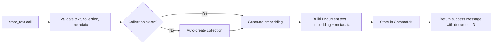
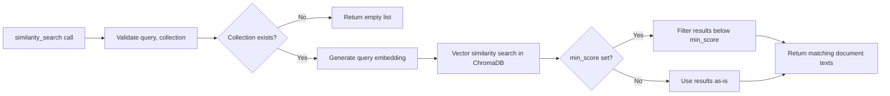
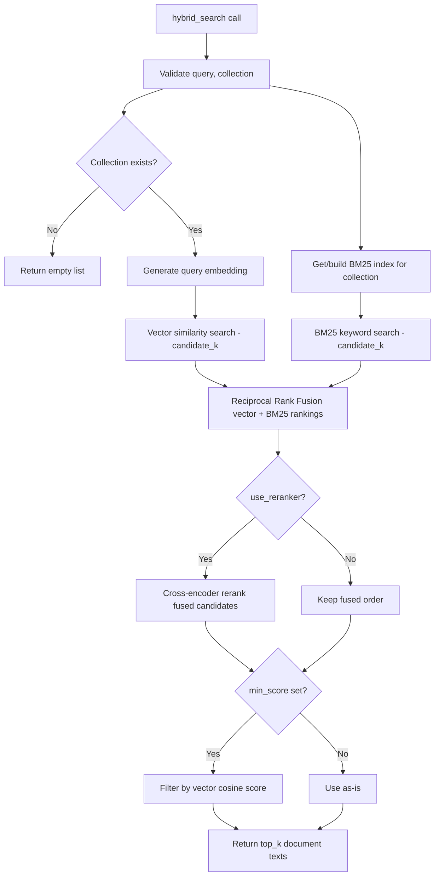
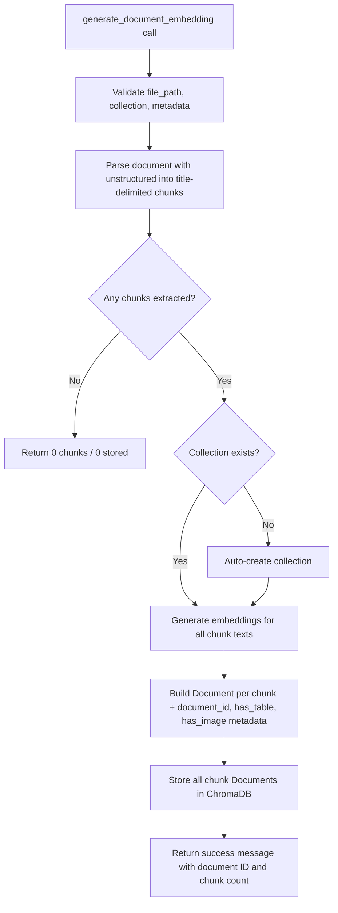

# MCP Vector Database Server

A Model Context Protocol (MCP) server that provides vector database functionality with automatic text embedding and similarity search. It lets AI applications store, chunk, index, and retrieve text/documents using semantic similarity, combined with BM25 keyword search and fusion for improved accuracy.

**Key capabilities:**
- **Text Storage**: Store text documents with automatic embedding generation
- **Similarity Search**: Semantic vector search
- **Hybrid Search**: Vector + BM25 keyword search fused via Reciprocal Rank Fusion, with optional cross-encoder reranking
- **Multiple Embedding Providers**: OpenAI and Sentence Transformers
- **Vector Database Support**: ChromaDB, via an extensible adapter pattern
- **Multiple Transport Modes**: STDIO, SSE, and Streamable HTTP
- **Metadata Support**: Store and filter documents with custom metadata
- **Auto Collection Management**: Automatic collection creation and management
- **Multimodal Document Ingestion**: Chunking + embedding for `.pdf`, `.md`, `.docx`, `.pptx`, with table/image detection

## Available Tools & Architecture

### `store_text`

Store raw text with automatic embedding generation.

```json
{
  "name": "store_text",
  "description": "Store text in the vector database with automatic embedding generation",
  "parameters": {
    "type": "object",
    "properties": {
      "text": { "type": "string", "description": "The text content to store", "maxLength": 100000 },
      "collection": { "type": "string", "description": "Collection to store the document in", "default": "documents", "pattern": "^[a-zA-Z0-9_-]+$", "maxLength": 63 },
      "metadata": { "type": "object", "description": "Optional custom metadata", "additionalProperties": true, "nullable": true }
    },
    "required": ["text"]
  },
  "returns": { "type": "string", "description": "Success message with document ID, text length, embedding dimension, metadata fields" }
}
```



### `similarity_search`

Semantic vector similarity search.

```json
{
  "name": "similarity_search",
  "description": "Perform similarity search to find relevant documents in the vector database",
  "parameters": {
    "type": "object",
    "properties": {
      "query": { "type": "string", "description": "The search query text" },
      "collection": { "type": "string", "description": "Collection to search in", "default": "documents" },
      "filters": { "type": "object", "description": "Optional metadata filters", "additionalProperties": true, "nullable": true }
    },
    "required": ["query"]
  },
  "returns": { "type": "array", "items": { "type": "string" }, "description": "Matching document text content" }
}
```

`top_k` and `min_score` are not caller-facing on this tool — they come from `SEARCH_DEFAULT_TOP_K` / `SEARCH_DEFAULT_MIN_SCORE`.



### `hybrid_search`

Fuses vector similarity and BM25 keyword search via Reciprocal Rank Fusion, with an optional cross-encoder rerank pass.

```json
{
  "name": "hybrid_search",
  "description": "Hybrid search: fuse vector (cosine) similarity and BM25 keyword search via RRF",
  "parameters": {
    "type": "object",
    "properties": {
      "query": { "type": "string", "description": "The search query text" },
      "collection": { "type": "string", "description": "Collection to search in", "default": "documents" },
      "filters": { "type": "object", "description": "Optional metadata filters applied to both retrieval legs", "additionalProperties": true, "nullable": true }
    },
    "required": ["query"]
  },
  "returns": { "type": "array", "items": { "type": "string" }, "description": "Matching document text content" }
}
```

Deployment-level tuning (not exposed as tool parameters): `SEARCH_DEFAULT_TOP_K`, `SEARCH_RRF_K`, `SEARCH_VECTOR_WEIGHT`, `SEARCH_BM25_WEIGHT`, `SEARCH_RERANKER_MODEL`, `SEARCH_USE_RERANKER`, `SEARCH_DEFAULT_MIN_SCORE`.



### `generate_document_embedding`

Extract, chunk, embed, and store a document (`.pdf`, `.md`, `.docx`, `.pptx`).

```json
{
  "name": "generate_document_embedding",
  "description": "Extract, embed, and store a document's chunks in the vector database",
  "parameters": {
    "type": "object",
    "properties": {
      "file_path": { "type": "string", "description": "Path to the document to process", "enum_extensions": [".pdf", ".md", ".docx", ".pptx"] },
      "collection": { "type": "string", "description": "Collection to store the embedded chunks in", "default": "documents" },
      "metadata": { "type": "object", "description": "Optional metadata attached to every stored chunk", "additionalProperties": true, "nullable": true }
    },
    "required": ["file_path"]
  },
  "returns": { "type": "string", "description": "Success message with document ID, collection, chunk count, stored document ID count" }
}
```

Each stored chunk is tagged with metadata: `chunk_id`, `document_id`, `source_filename`, `file_type`, `chunk_index`, `total_chunks`, `uploaded_at`, `has_table`, `has_image`.



**Package layout:**
- `adapters/` — vector DB adapter interface + ChromaDB implementation + factory
- `chunking/` — document parsing/chunking (`process_document.py`)
- `core/` — document embedding orchestration
- `embedding/` — embedding provider abstraction (OpenAI, Sentence-Transformers) + cache
- `search/` — BM25 index, RRF fusion, cross-encoder reranker
- `models/` — shared data models (`Document`)
- `tools/` — MCP tool definitions (`storage.py`, `search.py`, `document_embedding.py`)
- `config/` — environment-driven settings (`.env`)

## How to Run

### Prerequisites
- Python 3.8+
- pip
- `tesseract` and `poppler` (system packages, required by `unstructured` for document extraction used by `generate_document_embedding`). On macOS: `brew install tesseract poppler`.

### Setup

```bash
# 1. Clone
git clone <repository-url>
cd mcp-vectordb-server

# 2. Install dependencies
pip install -r requirements.txt            # basic
pip install -r requirements-dev.txt        # development (testing, linting)

# 3. Configure environment
cp .env.example .env
# edit .env with your configuration
```

### Start the Server

```bash
python main.py
```

Transport mode is set via `.env` (`MCP_TRANSPORT`): `stdio`, `sse`, or `streamable-http`.

## How to Connect

Pick a client transport matching your server's `MCP_TRANSPORT` setting:

| Transport | Endpoint / Mode | Example Client |
|---|---|---|
| `stdio` | Direct process communication | `python example_mcp_client_stdio.py` |
| `sse` | `http://127.0.0.1:8000/sse` | `python example_mcp_client_sse.py` |
| `streamable-http` | `http://127.0.0.1:8000/mcp` | `python example_mcp_client_streamable_http.py` |

See the example client scripts in the repo root for connection details for each transport.

## License

This project is licensed under the MIT License - see the [LICENSE](LICENSE) file for details.
